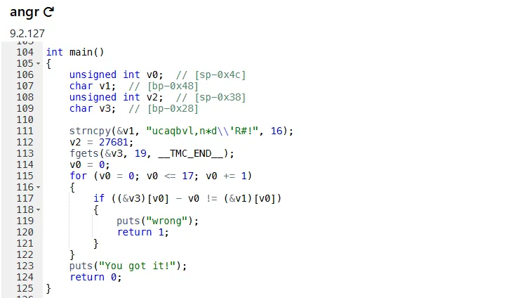
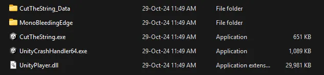
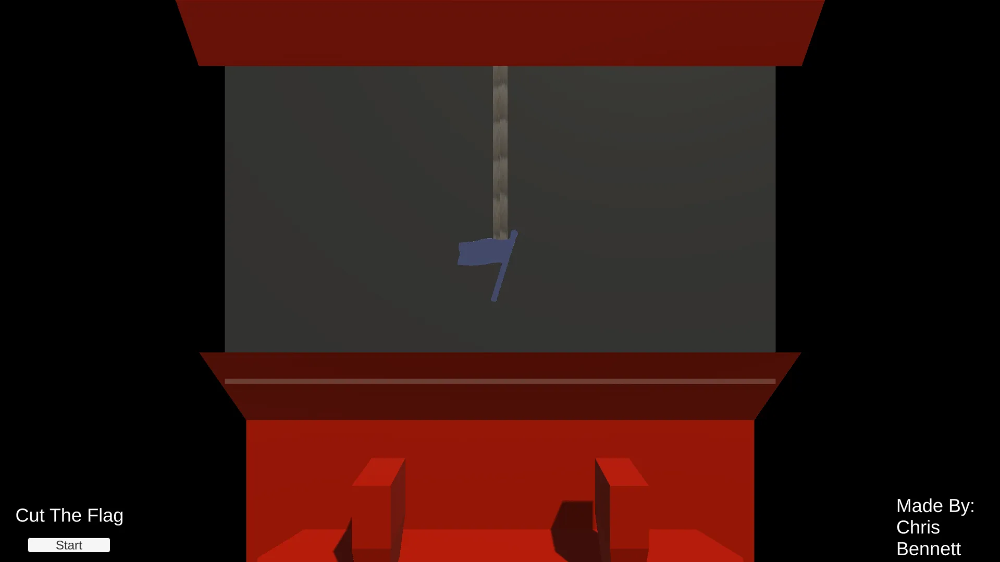
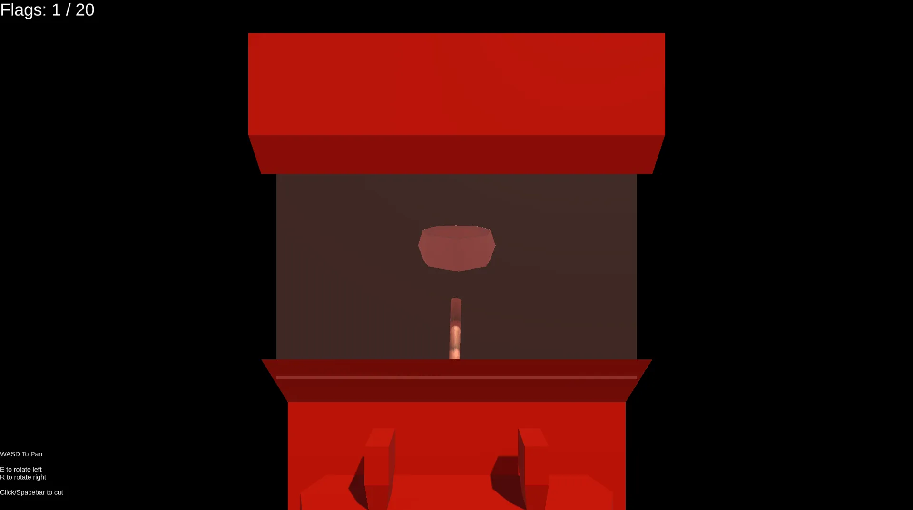
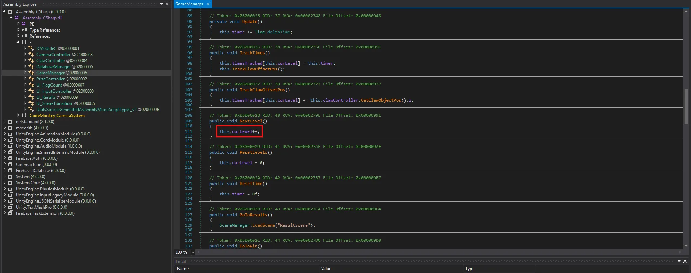
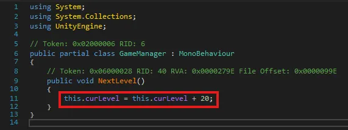
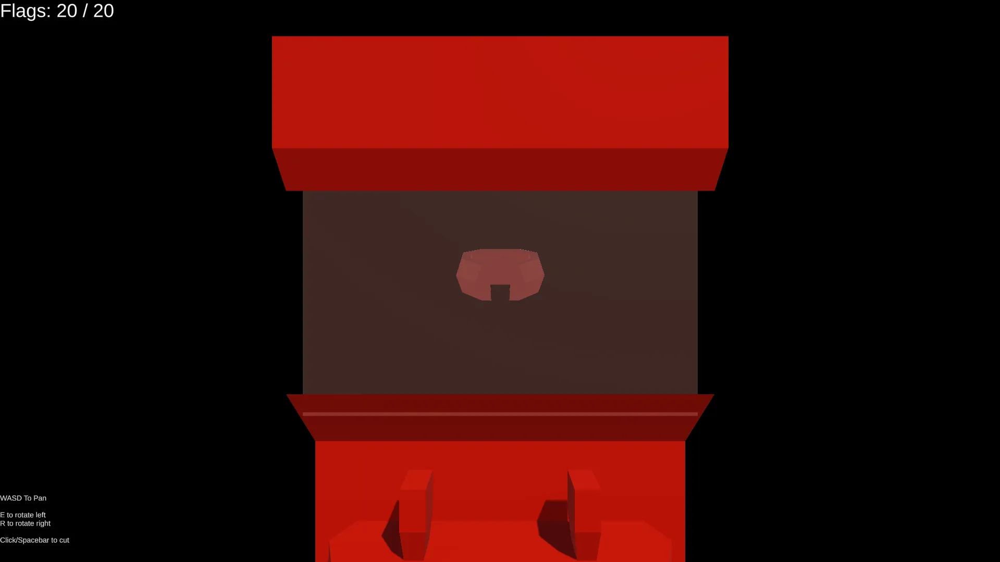
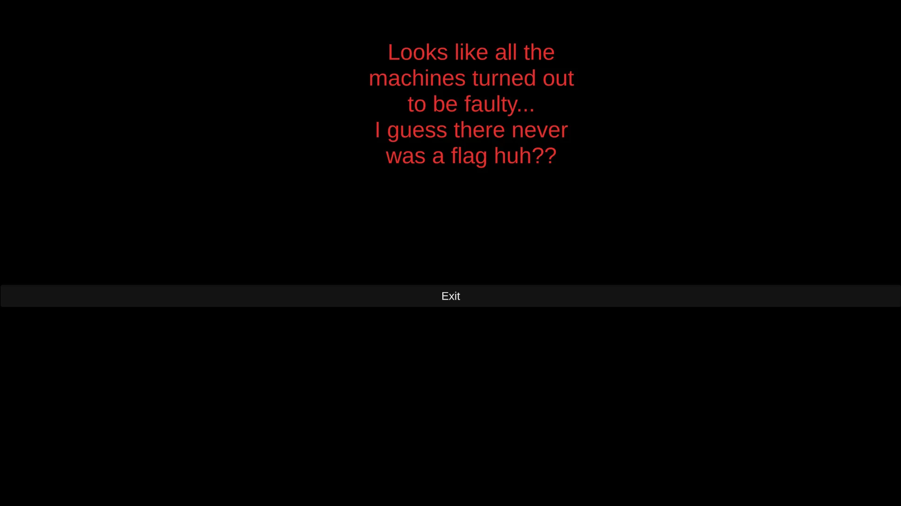
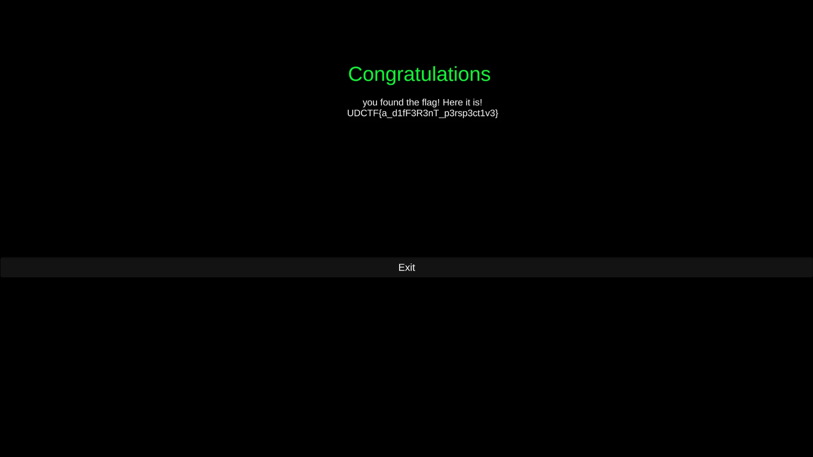

# Writeup: Reversing - BlueHens CTF 2024

[I joined BlueHens CTF 2024](https://krits.xyz/posts/bluehens_ctf_2024/)

## Problems I Can Do
- [Intro to Reverse](#problems-i-can-do)
- [Cut The Flag](#cut-the-flag)

## Intro to Reverse

`Just a classic flagchecker.`\
`(Try using [dogbolt.org](http://dogbolt.org/))`

I uploaded the file to [dogbolt.org](http://dogbolt.org/)  as instructed in the challenge.


The Reverse Code (Python)

```python
var_48 = "ucaqbvl,n*d\\'R#!!l"
flag = ""

for i in range(len(var_48)):
    # Increase the value of i for each character in var_48.
    char = chr(ord(var_48[i]) + i) 
    flag += char

print("Flag:", flag)
```

After running the script, I got the flag: 
```bash
udctf{r3v3ng3_101}
```

## Cut The Flag

I received the file `CutTheFlag v0.0.zip` and extracted its contents.\
Inside the `CutTheFlag v0.0.zip` file, I found the game:


It's a game where we have to cut the flags. As we cut them, the cutter speed increases, making it harder to press the button in time as the number of cuts grows.



To tackle this, I used dnSpy to reverse engineer the game. I located the file, which is found in , and edited the code.`Assembly-CSharp.dll` `CutTheString_Data\Managed\Assembly-CSharp.dll`

In the `GameManager` class, I modified the `NextLevel()` method. Instead of incrementing `curLevel` by 1 with `this.curLevel++`, I changed it to increment by 20 using `this.curLevel += 20`. This was to test if jumping ahead by 20 levels would work as intended.



After making the change, I got the expected result — the level increased by 20.


What??????


I tried playing the game again, and I finally got the flag!


The flag is:
```bash
UDCTF{a_d1fF3R3nT_p3rsp3ct1v3}
```
The `Cut The Flag` challenge was brainstormed with [Autsada Wiriya.](https://autsaa.top/)