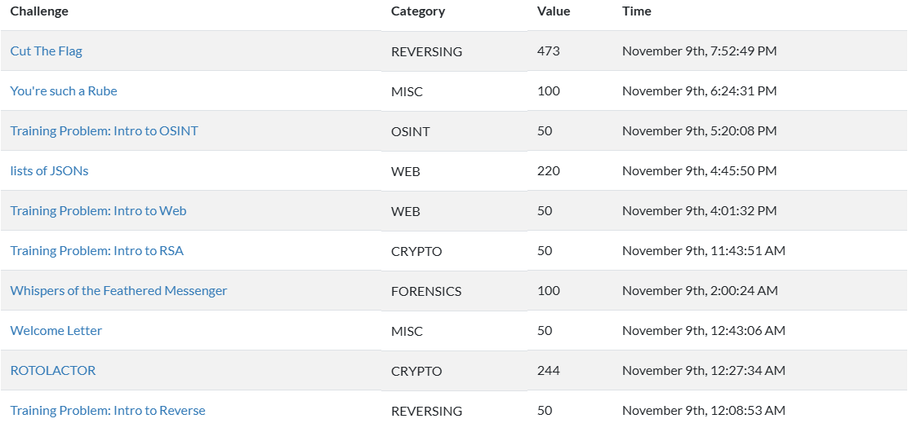

# 🕵️‍♀️ BlueHens CTF 2024 🎮

A jeopardy-style CTF organized by the University of Delaware's own CTF team in collaboration with BSides Delaware.

### 📊 **Team Overview: FlagF!nd3rz**

- **Rank**: 89th
- **Total Points**: 1387

### 🏅 **Members & Scores** 👾

| **Username**     | **Score** 🏆 |
| ---------------- | ------------ |
| 0xKr1ts **(me)** | 523 🏅       |
| autsadawiriya    | 494 🎯       |
| ueaarthorn       | 370 🔥       |
| Beam3876         | 0 ❌         |
| kxrndy           | 0 ❌         |

[🔗 View Scoreboard](https://ctftime.org/event/2512?fbclid=IwZXh0bgNhZW0CMTAAAR26kLmLgwlce5F8BIaWjFdz7X2ggDhXqnvmbdqW75yODjxEUrdP6KUxI4s_aem_R9XBhlo3rCF14HSLxAHmVw)

## 🧩 Challenge Solves 🎯
Here’s a breakdown of the challenges solved by **FlagF!nd3rz**

Each member contributed unique strengths to solve various challenges. This image highlights our journey through some of the toughest puzzles of BlueHens CTF 2024!

